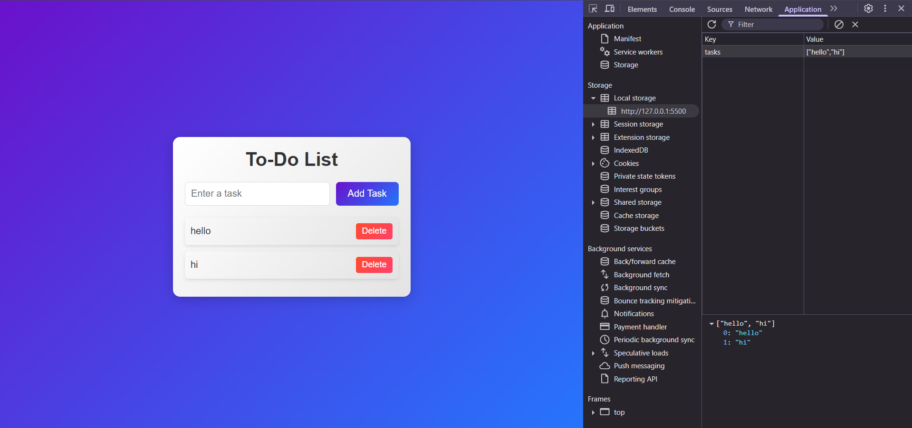

# To-Do List Application

A simple and elegant To-Do List application built with HTML, CSS, and JavaScript. This app allows users to add, delete, and persist tasks using local storage.

## Features

- Add tasks to the list.
- Delete tasks from the list.
- Tasks are saved in the browser's local storage, so they persist even after refreshing the page.
- Responsive and modern UI with gradient backgrounds and hover effects.

## Technologies Used

- **HTML**: Structure of the application.
- **CSS**: Styling with gradient backgrounds and responsive design.
- **JavaScript**: Functionality for adding, deleting, and saving tasks.

## How to Use

1. Enter a task in the input field and click the "Add Task" button to add it to the list.
2. Click the "Delete" button next to a task to remove it from the list.
3. Tasks are automatically saved in local storage.

## Screenshot

