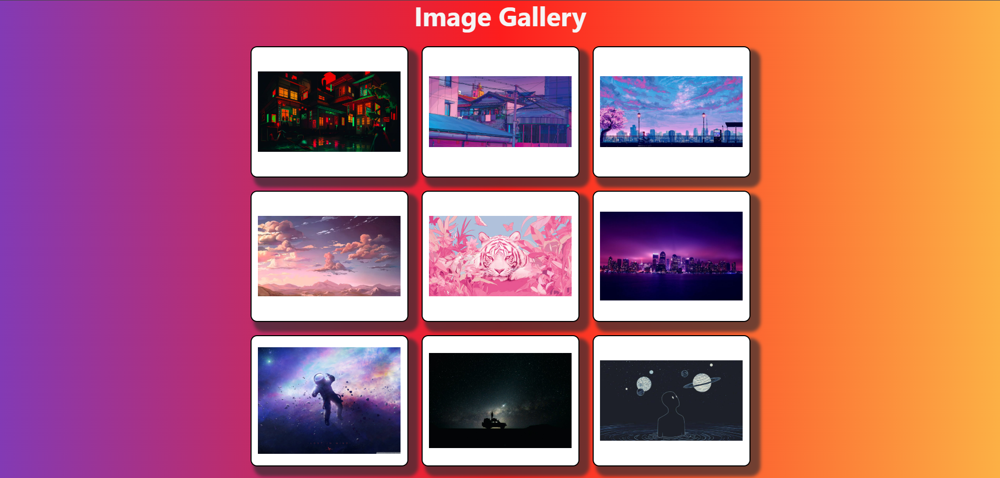
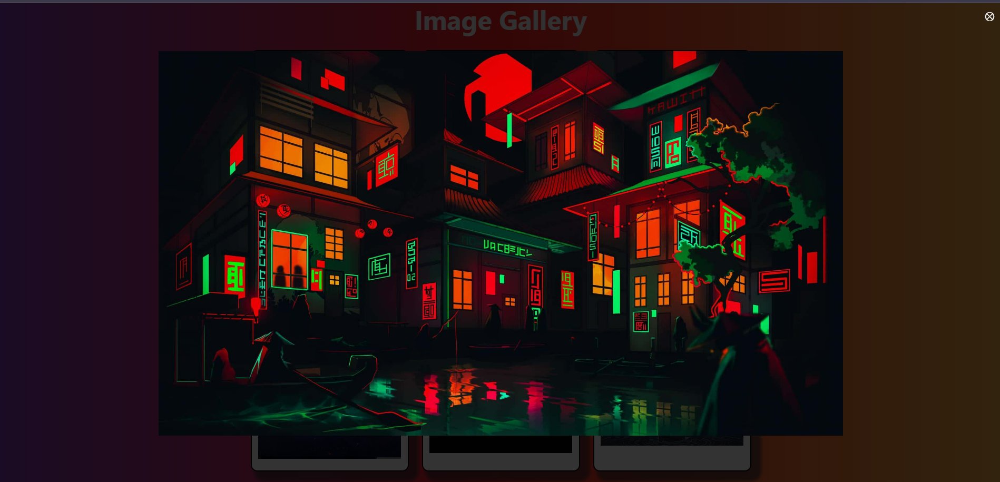

# Image Gallery Lightbox

## Question

**Objective:** Develop an image gallery where clicking a thumbnail opens a larger version in a modal/lightbox overlay.

### Requirements:
- Use event listeners to detect when a thumbnail is clicked.
- Dynamically update the modal content with the selected image.
- Toggle CSS classes to show/hide the modal and add transitions for smooth effects.

---

## Description

This project is a dynamic and visually appealing **Image Gallery** with a Lightbox feature. It displays a grid of image thumbnails, and clicking on any thumbnail opens the image in a modal overlay. The modal can be closed by clicking the close button.

### Features:
- Displays a grid of image thumbnails.
- Clicking a thumbnail opens the image in a modal (lightbox).
- Smooth transitions for showing and hiding the modal.
- Close the modal by clicking the close button (`×`).

---

## Screenshots

### Image Gallery Grid

### Lightbox Modal
