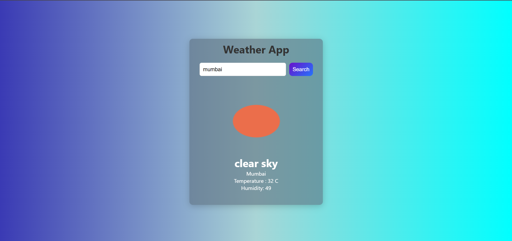
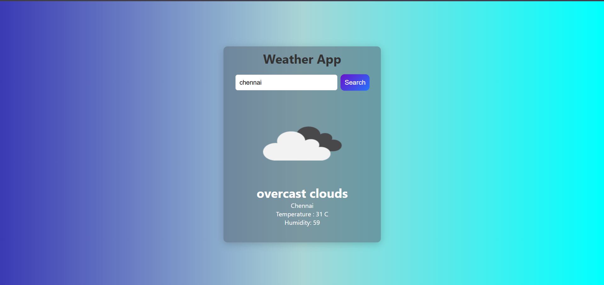

# Weather App

## Question

**Objective:** Create a Weather App that fetches and displays weather information for a given city using the OpenWeatherMap API.

### Requirements:
- Use an input field to allow users to enter a city name.
- Fetch weather data from the OpenWeatherMap API.
- Display the weather information, including temperature, humidity, and description.
- Show an appropriate weather icon based on the current weather conditions.

---

## Description

This project is a **Weather App** that allows users to search for weather information by entering a city name. The app fetches data from the OpenWeatherMap API and displays the following details:
- City name
- Temperature (in Celsius)
- Humidity
- Weather description
- Weather icon

The app also handles invalid city names gracefully by displaying an error message.

### Features:
- Fetches real-time weather data using the OpenWeatherMap API through 'Fetch'.
- Displays weather details with a visually appealing layout.
- Provides error handling for invalid city names.
- Responsive design with smooth hover and transition effects.

---

## Screenshots

### Weather App Interface

