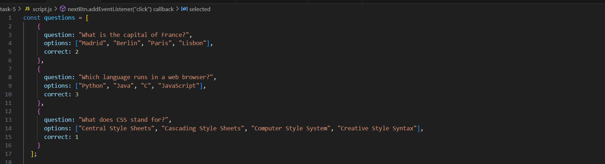
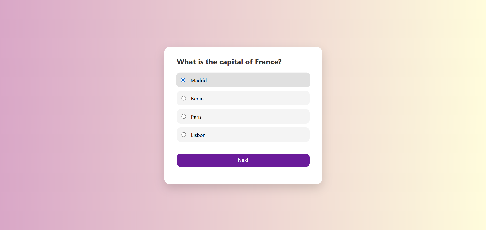
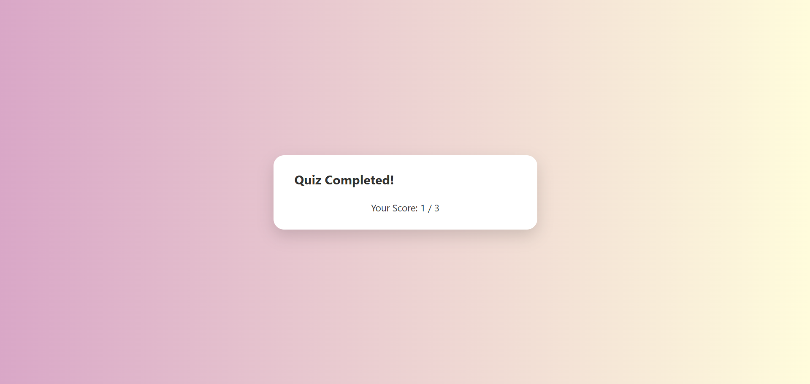

# Quiz App

## Question

**Objective:** Create a Quiz App that displays multiple-choice questions, allows users to select answers, and calculates the final score.

### Requirements:
- Dynamically load questions and options from a predefined list.
- Use event listeners to handle user interactions.
- Display the next question when the user clicks the "Next" button.
- Show the final score after the quiz is completed.

---

## Description

This project is a **Quiz App** that presents a series of multiple-choice questions to the user. The app dynamically loads questions and options, tracks the user's score, and displays the final result at the end of the quiz.

### Features:
- Displays one question at a time with multiple-choice options.
- Allows users to select an answer and proceed to the next question.
- Calculates and displays the final score after the quiz is completed.
- Responsive design with smooth hover and transition effects.

---

## Screenshots

### Questions as Objects

### Quiz App Interface

### Final Score
