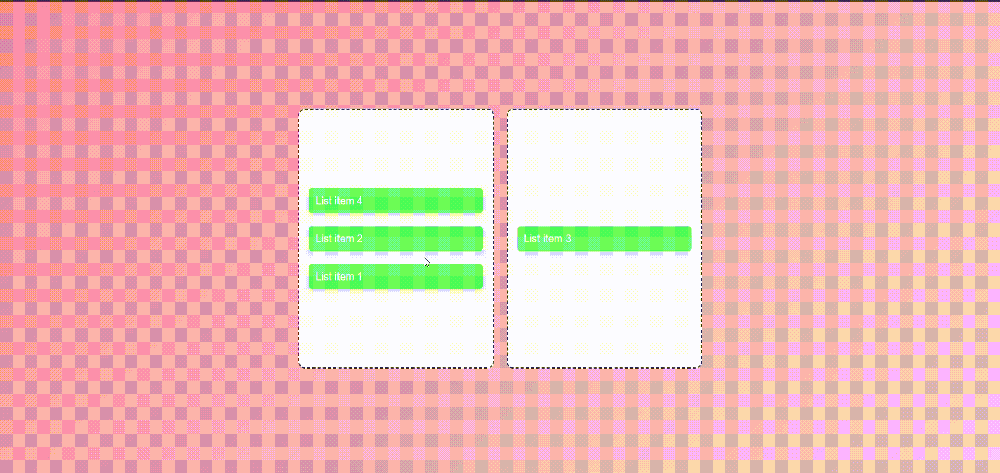

# Drag and Drop List Reordering  

## Objective  
Implement a list that allows users to reorder items using drag and drop functionality.  

## Requirements  
- Leverage the HTML5 Drag and Drop API to manage drag events.  
- Update the DOM to reflect the new order of items after a drop.  
- Provide visual feedback during drag operations (e.g., highlight potential drop targets).  

## Demo  
  

## Conclusion  
This implementation provides a simple and interactive way to reorder list items using the HTML5 Drag and Drop API.  