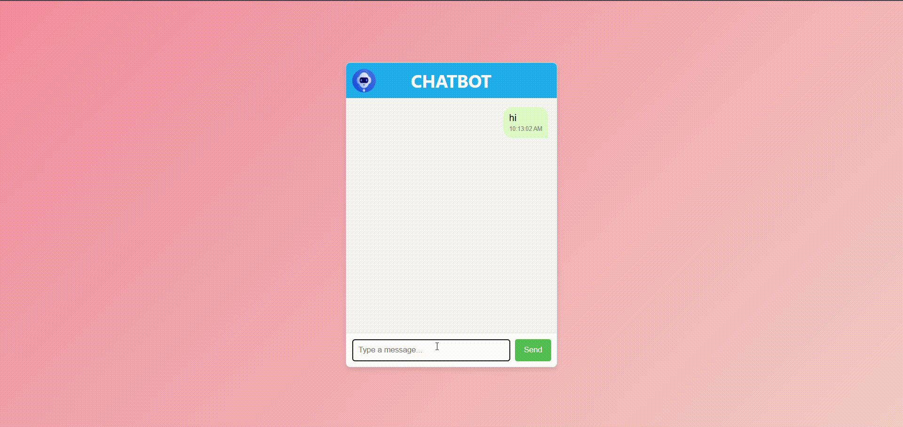

# 💬 Real-Time Chat Simulation (No Backend)

### ❓ What is this?
This is a **frontend-only simulation of a real-time chat interface**. It mimics user-bot interactions using JavaScript's `setTimeout`, giving the illusion of a live messaging system without any backend server or API calls.

---

### 🧠 What does it do?
- Allows user to type and send messages
- Displays chat messages with timestamps
- Simulates incoming bot replies after random delay
- Formats messages in **left (bot)** and **right (user)** bubbles
- No libraries or frameworks – pure HTML, CSS, JavaScript

---

### 🖼️ Preview

